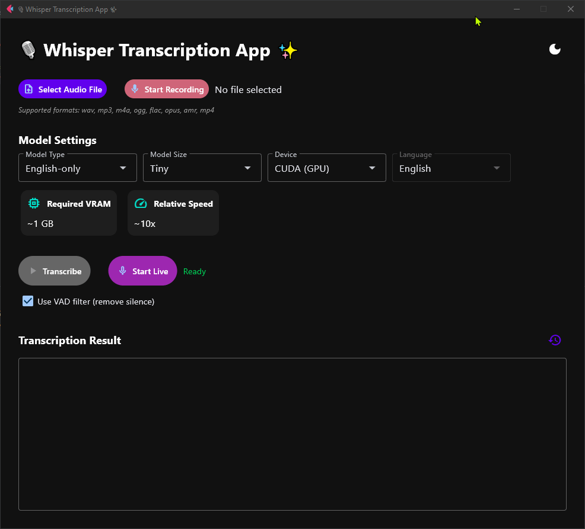

# 🎙️ Whisper Realtime Echo 🚀

A modern GUI for Faster Whisper speech recognition model using Flet framework.

> ⚠️ This application has been tested and confirmed working on Windows. While it may work on other platforms (Linux, macOS), they have not been officially tested.



## ✨ Features

- 🔊 Transcribe audio files with a beautiful UI
- 🎤 Record audio directly and transcribe it
- 🎧 Live transcription with real-time speech recognition
- 🌍 Choose between English-only and multilingual models
- 🗣️ Select language for multilingual models (auto-detect available)
- 🌐 Translate any language to English text
- 📏 Select model size with VRAM/speed indicators
- 💻 GPU (CUDA) or CPU processing
- 📊 Real-time transcription status
- 🧩 Modular, maintainable codebase
- 📋 Copy results to clipboard with history access
- 🌓 Toggle between light and dark themes

## 📋 Model Information

| Size | Parameters | English-only | Multilingual | VRAM | Speed |
|------|------------|--------------|--------------|------|-------|
| tiny | 39 M | ✅ tiny.en | ✅ tiny | ~1 GB | ~10x |
| base | 74 M | ✅ base.en | ✅ base | ~1 GB | ~7x |
| small | 244 M | ✅ small.en | ✅ small | ~2 GB | ~4x |
| medium | 769 M | ✅ medium.en | ✅ medium | ~5 GB | ~2x |
| large | 1550 M | ❌ N/A | ✅ large | ~10 GB | 1x |
| turbo | 809 M | ❌ N/A | ✅ turbo | ~6 GB | ~8x |

> 💡 English-only models typically perform better for English transcription.

## 🚀 Included Pre-quantized Models

For optimal real-time transcription speed, the application includes pre-quantized int8 versions of the tiny models:

- `int8_tiny_en`: Pre-quantized tiny.en model for English transcription
- `int8_tiny`: Pre-quantized tiny model for multilingual transcription

These models were created using CTranslate2's conversion tool with the following command:

```bash
ct2-transformers-converter --model openai/whisper-tiny.en --output_dir int8_tiny_en --copy_files tokenizer.json preprocessor_config.json --quantization int8
```

## 🚀 Quick Start

### Installation

```bash
# Clone repository
git clone https://gitlab.com/alouiadel/whisper-realtime-echo.git
cd whisper-realtime-echo

# Create and activate virtual environment
# For Windows:
python -m venv venv
venv\Scripts\activate

# For macOS/Linux:
python -m venv venv
source venv/bin/activate

# Install dependencies
pip install -r requirements.txt
```

> 🔥 **For GPU acceleration:** If you want to use CUDA for GPU acceleration, install the appropriate PyTorch version from [PyTorch official installation guide](https://pytorch.org/get-started/locally/)

### Usage

```bash
# Run the application
python main.py
```

1. 📂 Click "Select Audio File" or 🎤 "Start Recording"
2. 🌐 Choose model type and size
3. 📊 Select processing device (CPU/GPU)
4. ▶️ Click "Transcribe" for file processing or 🎙️ "Start Live" for real-time transcription
5. 📝 View results and use the toolbar to:
   - 📋 Copy to clipboard
   - 📜 Access transcript history
   - 🌓 Toggle theme (top-right corner)

## 🎙️ Live Transcription:
  - Provides real-time speech-to-text from your microphone
  - Automatically detects and processes speech in chunks
  - Optimized for maximum responsiveness:
    - Uses int8 quantization (reduces memory usage by ~40%)
    - Reduced beam size (1 instead of 5)
    - Greedy decoding with temperature=0
    - Independent chunk processing
    - Disabled timestamps generation
  - Best practices:
    - Works best in quiet environments
    - Smaller models offer faster response times
    - Use a clear, consistent speaking voice

## 🎧 Supported Audio Formats

Whisper leverages ffmpeg to process audio, supporting a wide range of formats:
- Audio files: wav, mp3, m4a, ogg, flac, opus, amr
- Video files: mp4 (and other video formats with audio tracks)

## 📜 Clipboard History

- View, copy, and reuse previous transcriptions
- Saved between sessions with timestamps and model info
- Most recent 50 entries are retained

## 📝 Notes & Limitations

- **Language Selection**: Helps Whisper optimize recognition but doesn't translate content. English audio will still be transcribed as English even when another language is selected.

- **Transcribe vs. Translate Modes**:
  - **Transcribe**: Converts speech to text in the original language (default)
  - **Translate**: Converts speech from any language to English text

- **Translation Best Practices**:
  - Automatically sets language to "Auto-detect" for optimal results
  - Works best with larger models (large or turbo) and clear audio
  - Some languages may require transcribing first, then using a separate translation service

- **System Requirements**: If crashes occur, try using a smaller model or ensure your system meets the memory requirements in the model table.

## 🙏 Credits

This project is powered by [Faster Whisper](https://github.com/SYSTRAN/faster-whisper), a highly optimized implementation of OpenAI's Whisper. The Whisper model was trained on a large dataset of diverse audio and is capable of multilingual speech recognition, translation, and language identification.

## 📄 License

This project is licensed under the MIT License - see the [LICENSE](LICENSE) file for details.
